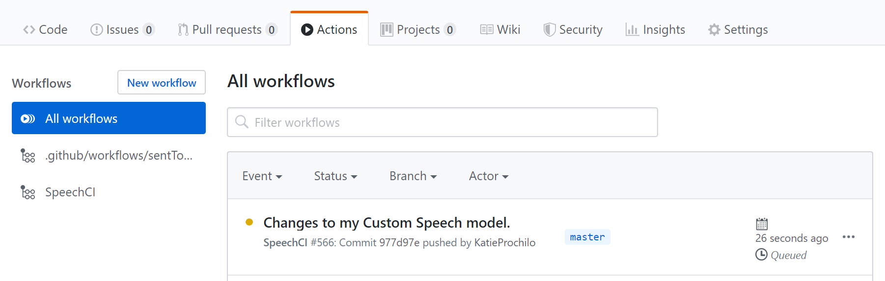
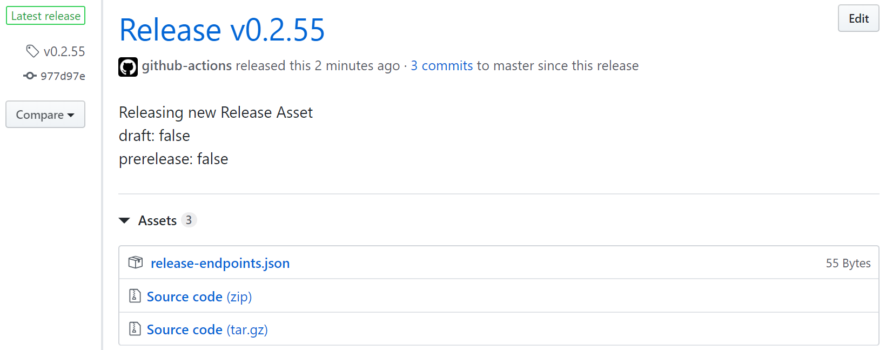

# 2. Create the Initial Custom Speech Model

The objective of this workflow is to continuously improve Custom Speech models. To do that we will need to create an initial model to which we can compare future models. First, [click here](./1-project-setup.md) to set up your repository if you have not already done so.

### Table of Contents

* [Pull Request Training Data Updates](#Pull-Request-Training-Data-Updates)
    * [Locally Test Training Data Updates](#Locally-Test-Training-Data-Updates)
    * [Create and Merge the Pull Request](#Create-and-Merge-the-Pull-Request)
* [Workflow for Training Data Updates](#Workflow-for-Training-Data-Updates)
    * [Train](#Train)
    * [Test](#Test)
    * [Release](#Release)
* [Next Steps](#Next-Steps)

## Pull Request Training Data Updates

`cd` into the root of the repository and checkout the **master** branch. From there, create a feature branch:

```bash
git checkout -b initialSpeechModel
```

The Custom Speech CI/CD workflow will run any time data in the `testing` or `training` folder is updated. So, to run the workflow for the first time, make a change to at least one of the following files:
* `training/related-text.txt`
* `training/pronunciation.txt`
* `training/audio-and-trans.txt`

You can also make changes to `testing/audio-and-trans.txt`, but changes to testing data will not do anything until after the initial Custom Speech model has been created.

Add and commit the changes:

```bash
git add .
git commit -m "Changes to my Custom Speech model."
```

### Locally Test Training Data Updates

For the sake of the sample, changes don't need to be tested locally.

In a real-world, production-worthy scenario, developers should create a personal Azure Speech resource to test their changes before submitting them to a greater audience.

[Click here](https://docs.microsoft.com/en-us/azure/cognitive-services/speech-service/how-to-custom-speech-evaluate-data) to learn how to test a Custom Speech model and evaluate its accuracy using the [Speech Studio](https://speech.microsoft.com/portal/). Testing will take more time the more data there is. If using the entire test data set takes too long, developers may create a  randomized subset of the test data set to use for testing on the Speech Studio.

Once developers feel their changes will generally improve the model, they can submit the updates in a Pull Request.

### Create and Merge the Pull Request

Push the changes to the remote repository:

```bash
git push -u origin initialSpeechModel
```

Create a Pull Request from the branch **initialSpeechModel** into **master**. If you have properly set up the branch protections, it will be necessary to Approve the Pull Request. [Click here](https://help.github.com/en/github/collaborating-with-issues-and-pull-requests/creating-a-pull-request) for more information on creating Pull Requests.

Now merge or rebase the Pull Request into **master**. If everything has been set up properly, the workflow will automatically execute after a few seconds. Navigate to the **Actions** tab of the repository to check out the workflow in progress:



## Workflow for Training Data Updates

The objective of the first update to training data is to train and test an initial Custom Speech model so that its accuracy can be used as a benchmark to which future models can compare their accuracy.

### Train

When training data is updated for the first time, the data from the `training` folder is used to build a new Custom Speech model. Please note that building Custom Speech models will take upwards of 30 minutes.

### Test

This new model is tested with data from the `testing` folder. The test will create a test summary file and a test results file.

The test summary contains a value, Word Error Rate (WER), which will be used to measure and benchmark a model's accuracy. WER is a common measure of performance in speech recognition. It is the sum of substitutions, deletions, and insertions divided by the number of words in a sentence. Essentially it's a measure of how many words were recognized incorrectly.

In future runs, it matters that the WER improves and gets lower over time, but this initial run will simply set a baseline WER for future runs.

The test summary and test results will be stored in an Azure Storage container called `test-results`. An Azure Storage container called `configuration` will also be created. It will store a single file, `benchmark-test.txt`, which will point to the test summary file from the initial model. [Click here](https://ms.portal.azure.com/#home) to visit the Azure Portal and navigate to your Azure Storage Account to view these additions.

### Release

Finally, a Custom Speech endpoint will be created from this initial model, and a GitHub Release will be created that will contain this endpoint. Each time an endpoint is released, the repository is tagged with a new version. [Click here]() for more details on releases, and how to customize them for use outside of the sample.

To find the best-performing Custom Speech endpoint, navigate to the **Code** tab in the repository, then click the **Releases** sub-tab. At the top of the releases page will be a release with an icon next to it that says **Latest release**, the commit hash the model was built from, and the Custom Speech model's version:



Click on the file **release-endpoints.json** to download it. It will contain the Custom Speech endpoint created in the workflow:

```json
{"ENDPOINT_ID":"########-####-####-####-############"}
```

The latest release will always contain the best-forming Custom Speech endpoint. Users can update endpoints in their client applications to use the latest release at their own discretion. [Click here](./4-advanced-project-setup.md#Managing-Endpoints) after finishing the required steps to learn about managing endpoints.

## Next Steps

You have built your first Custom Speech model which will serve as a benchmark on which to improve future models. [Click here](./3-improve-custom-speech-models.md) to learn how update testing and training data and build better models.
